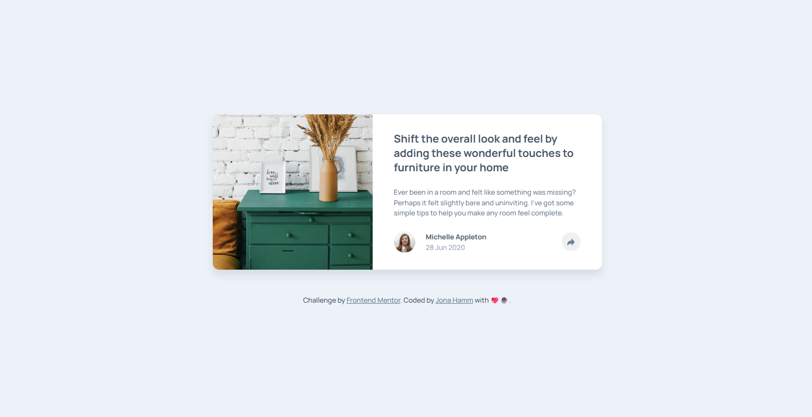
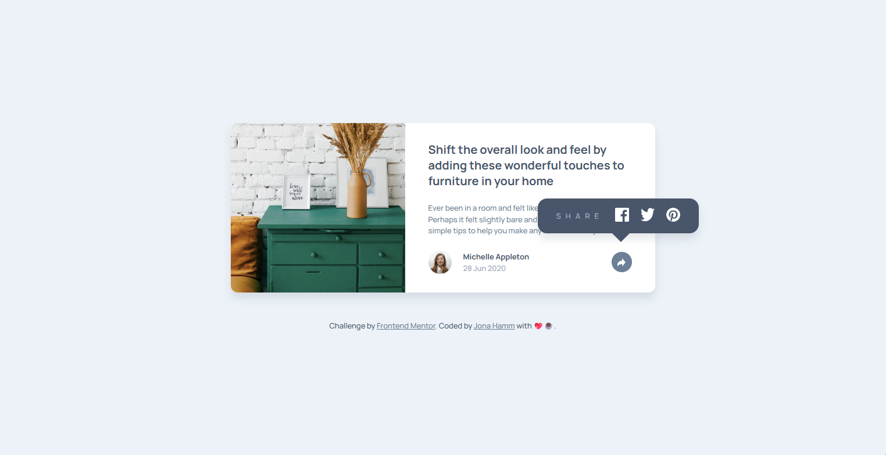

# 🌐 Frontend Mentor - Article preview component solution

This is my solution for the [Article preview component challenge on Frontend Mentor](https://www.frontendmentor.io/challenges/article-preview-component-dYBN_pYFT). Frontend Mentor challenges help you improve your coding skills by building realistic projects.

---

## 📋 Table of contents

- [Overview](#-overview)
  - [Features](#-features)
  - [Preview](#-preview)
  - [Links](#-links)
- [My process](#-my-process)
  - [Built with](#-built-with)
  - [What I learned](#-what-i-learned)
- [Development Workflow](#-development-workflow)
- [Useful Resources](#-useful-resources)
- [Author](#-author)
- [Acknowledgments](#-acknowledgments)

---

## 🌍 Overview

### ✨ Features

A responsive article preview component featuring an interactive share menu with smooth animations.
Built with semantic HTML, modern CSS, and vanilla JavaScript, with a focus on clean layout, accessibility, and subtle UI details.

### 🖼️ Preview





### 🔗 Links

- 💡 Solution URL: [Frontend Mentor Submission](https://www.frontendmentor.io/solutions/testimonial-grid-section-with-css-Wz0V818HmW)
- 🌐 Live Site URL: [Live Demo](https://thewizard04-artcile-preview.vercel.app)

---

## 🛠️ My process

### 🧰 Built with

| Category  | Tools                     |
| --------- | ------------------------- |
| Structure | **Semantic HTML5 markup** |
| Styles    | **CSS**                   |

### 🧠 What I learned

- Improved my understanding of semantic HTML5 markup
- Learned and used aria-labels & -status for better accessibility
- Strengthened my styling skills using CSS
- Strengthened my animation skills using CSS transition/keyframes

Here are the snippets of the animation for the share menu (for mobile devices):

```css
.share-menu {
  ...

  opacity: 0;
  transform: scaleX(0);
  transform-origin: right;
  pointer-events: none;

  transition:
    transform 0.4s ease,
    opacity 0.3s ease;
}

.article-details.open .share-menu {
  opacity: 1;
  transform: scaleX(1);
  pointer-events: auto;
}
```

Here are the snippets for the nice spin animation when the menu gets opened:

```css
.article-details.open .share-btn {
  background-color: var(--color-desaturated-dark-blue);
  animation: spin-wiggle 1.2s ease;
}
```

```css
@keyframes spin-wiggle {
  0% {
    transform: rotate(0deg);
  }
  33% {
    transform: rotate(390deg);
  }
  66% {
    transform: rotate(330deg);
  }
  100% {
    transform: rotate(360deg);
  }
}
```

---

## 🧩 Development Workflow

### 🧱 Local Setup

1. **Start using CSS in your HTML**

   ```html
   <link rel="stylesheet" href="styles.css.css" />
   ```

2. Then open your index.html file in the browser.

---

## 📖 Useful Resources

- [MDN Web Docs](https://developer.mozilla.org/) – Trusted documentation and guides for modern web technologies.
- [W3Schools](https://www.w3schools.com/) – Easy-to-follow tutorials and references for learning web development.

---

## 👨‍💻 Author

- GitHub - [Jona Hamm](https://github.com/CrazyWizard04)
- Frontend Mentor - [@CrazyWizard04](https://www.frontendmentor.io/profile/crazywizard04)

---

## 💖 Acknowledgments

A big thanks to **Frontend Mentor** for providing this project.
Their challenges are a great way for developers of all levels to practice, learn, and improve their skills through real-world examples.

Thank you <3
